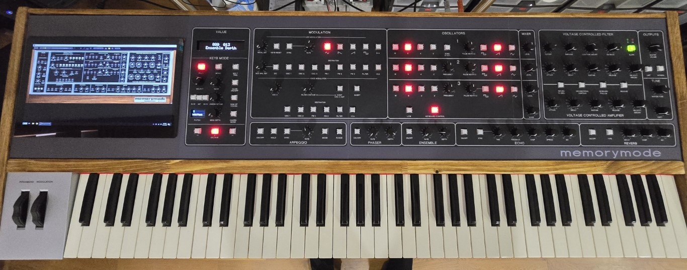

# Cherry Audio - Memory Mode hardware editor

Hardware editor for the Cherry Audio VST, it can be used as a hardware editor for the VST on a PC or MAC etc or with a built in PC it can be used as a standalone instrument.

Early stages of development, basically all buttons and pots are working and I am just tailoring the code to fit the functions of the VST.

Included are two USB-C MIDI interfaces to connect the editor to the PC or MAC if you do not have an inerface already, one interface is for MIDI and the other for HID commands required to control aspects opf the VST.

* Things to do:-
* Add the VST percentage params to the small OLED.
* Test all functionality
